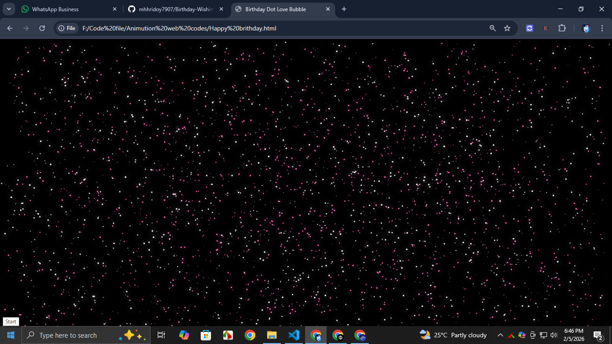
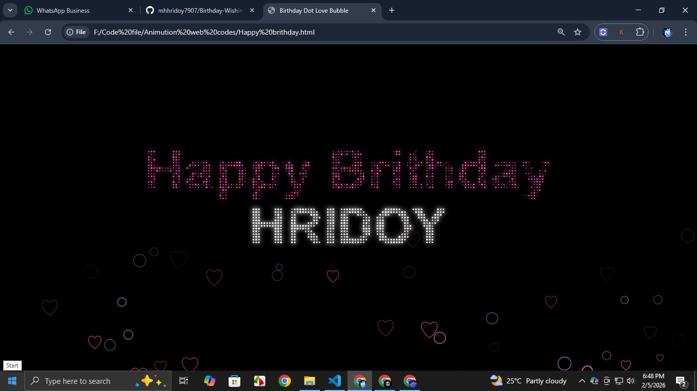

# Birthday Dot Love Bubble 🎉💖 

## 🎥 Demo Video

<video width="600" controls>
  <source src="1234.wmv" type="video/wmv">
  Your browser does not support the video tag.
</video>
---

A mesmerizing interactive **dot and bubble animation** for celebrating birthdays!  
Click anywhere on the canvas to toggle a magical birthday text animation with floating hearts and glowing dots.

---

## Demo

- **Dots**: Randomly floating, glowing dots in white and hotpink.  
- **Bubbles**: Love-themed heart bubbles that float upward.  
- **Text Mode**: Click anywhere to form birthday messages like `Happy Birthday` and a name (e.g., `Fatema`) using dots.  

---

## Screenshots

Here are some visuals of the animation in action:

  
*Glowing dots floating randomly.*

  
*Text mode with heart bubbles.*

> **Note:** Make sure to put your images in an `images` folder in the same directory as the README.

---

## Features

- Interactive click-to-toggle **text animation**.  
- Floating **heart and normal bubbles** with fading alpha.  
- Responsive **full-screen canvas**.  
- Colorful **hotpink and white glowing dots**.  
- Smooth, continuous animation using `requestAnimationFrame`.

---

## How to Use

1. Clone or download this repository.
2. Open `index.html` in a modern web browser.
3. Click anywhere on the canvas to toggle the birthday message animation.

---

## Customization

- **Change Name**: Update the name in the `getTextPoints` function:
  ```javascript
  const t2 = getTextPoints("Fatema", canvas.height/2+60, "bold 110px Arial");
